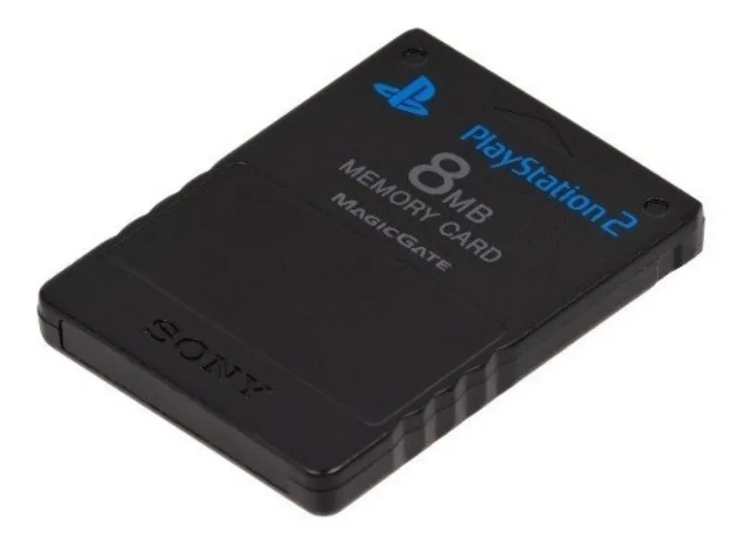
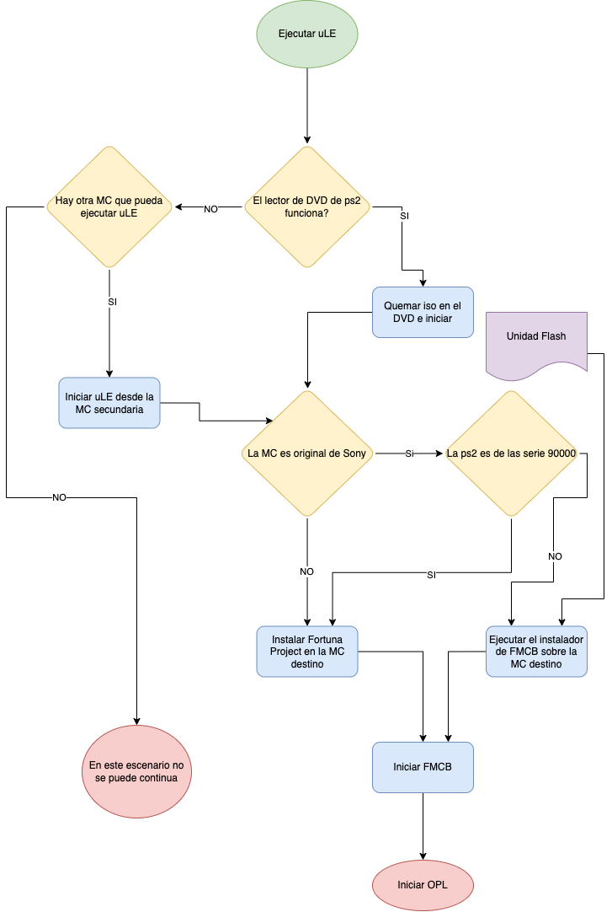

# FMCB-OPL-uLE-ultimate_guide
Guia definitiva para instalar Free MC Boot y opl en cualquier Play Station 2 (ps2) Slim

## Glosario
**Memory Card (MC)**: son tarjetas de memoria que utiliza la play station para leer y almacenar informacion

**Free MC Boot (FMCB)**: Es un programa que se instala en una MC y permite ejecutar aplicaciones desde la misma MC, desde una unidad flash o desde un disco duro

**Open PS2 Loade (OPL)**: Es una aplicacion que permite ejecutar los juegos desde una unidad flash, desde una ubicacion de red o de un disco duro, tambien se puede configurar para ejecutar otras aplicaciones. Es tal vez la aplicacion mas interesante para PS2

**uLaunchELF (uLE)**: Es un gestor de archivos que permite acceder a los medios de almacenamiento de la PS2, tambien puede ejectuar aplicaciones que tengan la extion ELF.

**Fortuna Project**: Es un programa que permite iniciar otro programa en una MC, se utliza para los casos donde no se puede isntalar FMCB directamente en la MC, o para las ps2 de la serie 90000

# Pasos para jugar juegos desde pen drive

`El objetivo final de esta guia es poder cargar juegos desde una unidad flash o desde una ubicacion de red para llegar a este punto hay que hacer varios pasos, es un proceso tedioso pero al momento no existe un proceso mas simple`

1. El primer paso es poder ejecutar uLE en la ps2. En este punto solo nos enfocamos en lograr ejecutar la aplciacion uLE y nada mas. Existen dos formas de hacerlo

  - Utilizando la lectora de discos

    [Como grabar correctamente tu ulaunchelf en un DVD](https://www.youtube.com/watch?v=KM-8LjbqeGg)

    > Existen varias imagenes ISO de uLE dando vuelta en internet, la que a mi me funciono es [uLE v4.34](https://mega.nz/file/3V02gbJD#jUDnwuTwZFGrLIFaJZwXjZAe2Je6Nl7638QFtVUL5Gk)

  - Con otra MC que pueda ejecutar ULE

    Con una MC (distinta a la que vamos a utilizar para nuestro sistema) que ejecute en el PS2 y podamos abrir uLE, esto es suficiente para el siguiente paso

> :warning: Si la lectora no funciona y no se tiene otra MC no hay forma de continuar, la solucion seria conseguir una ps2 con la lectora funcionado. Tambien es posible adquirir una MC ya preparada por internet. Algunas casa de videojuegos instlana el FMCB o Fortuna en las MC

2. El siguente paso es intstalar el [FMCB](https://www.ps2-home.com/forum/viewtopic.php?t=1248) o el [Fortuna Project](https://www.ps2-home.com/forum/viewtopic.php?t=8542)

  - Si la PS2 no es de la serie 90000 y si la MC es orignal de SONY utilizaremos FMCB, las versiones estan en interent pero en este [enlace](Free%20MCBoot) hay algunas versiones.
      
      [Como INSTALAR FREE MCBOOT en Memory card PS2 | OPL | Metodo 2022](https://www.youtube.com/watch?v=-y1YJPI3aLo)

  - Si no se cumplen esas condiciones debemos instalar Fortuna, este repo ya cuenta con una [version](FunTuna-R2.psu) pero se puede desacargar la version mas reciente en www.ps2-home.com

      [Que es FORTUNA y Como se Instala (Fortuna Fácil en PS2)](https://www.youtube.com/watch?v=EAzWAHUot1U)
      
      > si mantemos apretado r1 al encender la consola se cargara automaticamente la MC1 y si mantenemos r2 la MC2
 
 3. Ya sea que hayamos usado Fortuna o FMCB en ambos casos tendremos una version de OPL disponible, pero sugiero descargar la mas reciente desde el sitio oficial [ps2homebrew/Open-PS2-Loader](https://github.com/ps2homebrew/Open-PS2-Loader/releases/)

  Una vez descargado el OPL se guarda en una unidad flash, conectamos a la ps2 y utilizando el ulauncher lo copiamos en la MC, el siguiente paso es actualizar en enlace en el menu del FMCB reemplzando el .ELF del OPL actual por el nuevo .ELF 

   [Actualiza tu OPL Viejo a uno mas Nuevo Facil !!!](https://www.youtube.com/watch?v=aRggRYbqVvc)
   
# Videos de interes

[Accesos Directos FMCB/PS2/OPL Y UlaunchELF](https://www.youtube.com/watch?v=lwpjgyrUCnk)

[Como solucionar TODOS los OTROS errores del OPL EN PS2](https://www.youtube.com/watch?v=mfQnWI0jv3Y)

[OPL en idioma español / Configurar OPL en español](https://www.youtube.com/watch?v=E5sywpPcVPc)

[Parchear juego PS2 de PAL a NTSC (Los mejores resultados](https://www.youtube.com/watch?v=a2Kg8nIaPpQ))

[DISABLED ACTIVAR Y DESACTIVAR CHIP MATRIX PS2](https://www.youtube.com/watch?v=ADrf8pVXJI8)

[inicio automatico de aplicaciones con freemcboot | configurar aplicaciones de inicio rápido ps2](https://www.youtube.com/watch?v=kWTQZD1puh8)

